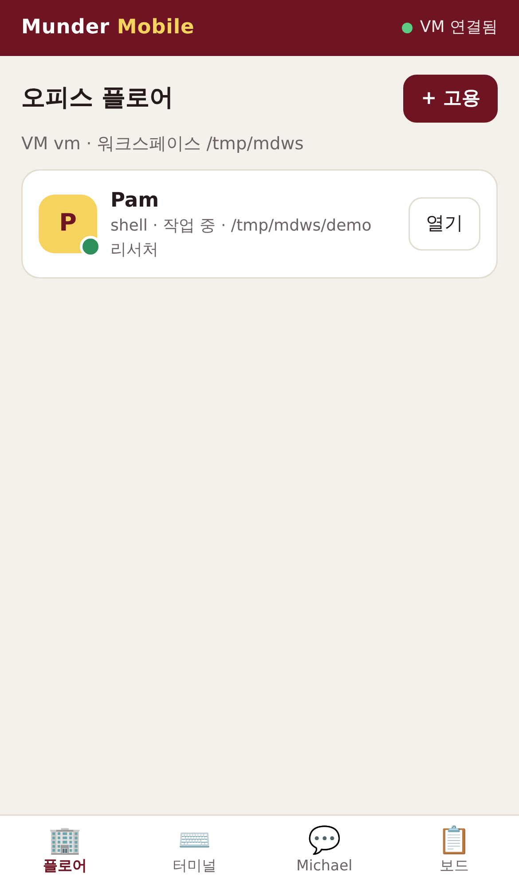
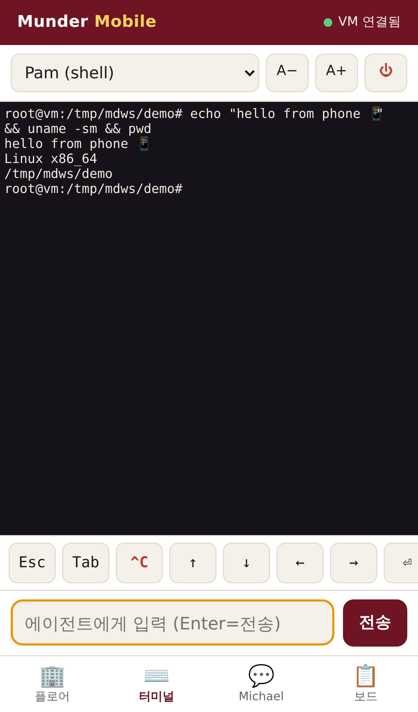
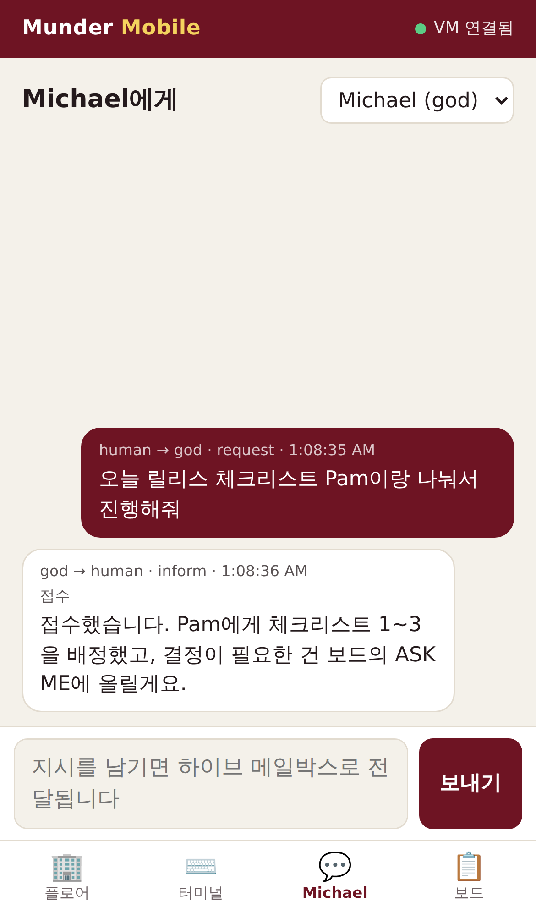
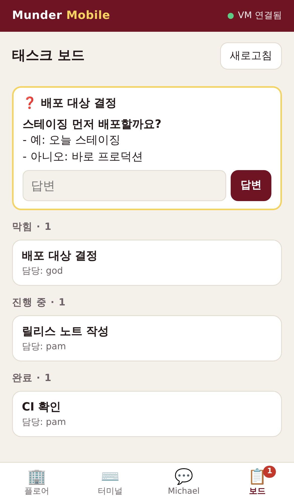

# Munder Mobile

[Munder Difflin](https://github.com/HarnessMD/munder-difflin)의 에이전트 오피스를 **가상컴퓨터(VM)에서 헤드리스로 실행**하고, **휴대폰 전용 PWA**로 조종합니다.

원본은 Electron 데스크톱 앱이라 모니터 앞에 있어야 합니다. Munder Mobile은 Electron 없이 같은 기능을 VM에서 돌립니다. 에이전트 CLI를 PTY로 실행하고, 원본과 같은 포맷의 하이브 메일박스·태스크 보드를 씁니다. 폰을 닫아도 에이전트는 VM에서 계속 일합니다.

<p>




</p>

## 구조

```
 📱 휴대폰 (PWA)                       ☁️ 가상컴퓨터 (VM)
 ┌───────────────┐   HTTPS / WSS   ┌─────────────────────────────────────┐
 │ 플로어·터미널  │ ◀────────────▶ │ gateway/server.js                    │
 │ Michael·보드   │  Bearer 토큰   │  ├ PtyHub  → claude / codex / … (PTY) │
 └───────────────┘                 │  └ Hive    → registry.json, tasks.json│
                                   │             agents/<id>/inbox|outbox  │
                                   └─────────────────────────────────────┘
```

| 원본 (Electron) | Munder Mobile |
| --- | --- |
| `PtyManager`가 PTY 출력을 창 하나로 보냄 | `PtyHub`가 여러 폰/탭으로 보내고, 256KB 스크롤백을 재접속 때 다시 보냄 |
| Pixi.js 오피스 플로어 | 카드형 플로어(작업 중·대기·종료 상태, 안 읽은 메일 수) |
| xterm.js 터미널 | xterm.js + 모바일 키바(Esc·Tab·^C·화살표·y/n) + 한 줄 입력창 |
| Command Bar → Michael | 하이브 메일박스로 `human → god` 메시지 전송, 답장 피드 |
| ASK ME 보드 | `tasks.json`의 `humanQA`에 답변을 적고 god에게 메일 발송 |
| 라우터 (outbox → inbox) | 같은 동작의 최소 라우터와 유휴 에이전트 깨우기(nudge) |

하이브 포맷은 원본 `HIVE.md` 스키마를 그대로 따릅니다. 메시지마다 JSON 파일 하나를 쓰고, 임시 파일에 쓴 뒤 원자적 rename으로 옮깁니다.

## 빠른 시작 (VM에서)

```bash
git clone <이 저장소> && cd munder-mobile
npm ci                      # node-pty 네이티브 빌드: build-essential, python3 필요
npm i -g @anthropic-ai/claude-code   # 쓸 에이전트 CLI 설치 (codex, gemini … 도 가능)

export MD_TOKEN="$(openssl rand -base64 32)"
MD_WORKSPACE=~/work npm start
# → pair URL:  http://127.0.0.1:8787/#t=<토큰>
```

폰에서 **pair URL**을 열면 토큰이 자동 저장됩니다. 토큰은 URL 프래그먼트(`#`)에 실려 있어 서버로 전송되지 않고, 저장 후 주소창에서도 지워집니다. 열린 화면에서 "홈 화면에 추가"를 누르면 앱처럼 쓸 수 있습니다.

### 폰에서 VM에 접속하는 방법

게이트웨이는 기본적으로 `127.0.0.1`에만 바인딩됩니다. 토큰만 있으면 VM 셸을 쓸 수 있으므로 **평문 HTTP로 인터넷에 노출하지 마세요.**

| 방법 | 명령 | 비고 |
| --- | --- | --- |
| **Tailscale** (권장) | VM과 폰에 Tailscale 설치 → `tailscale serve --bg 8787` | 사설망 + 자동 HTTPS |
| Cloudflare Tunnel | `cloudflared tunnel --url http://127.0.0.1:8787` | 공개 HTTPS URL이 생김. Cloudflare Access를 함께 쓰기를 권장 |
| SSH 포워딩 | `ssh -L 8787:127.0.0.1:8787 vm` | Termius 같은 모바일 SSH 앱 |

### Docker / systemd

```bash
docker build -f deploy/Dockerfile -t munder-mobile .
docker run -d -p 127.0.0.1:8787:8787 -e MD_TOKEN="$MD_TOKEN" \
  -v munder-work:/work -v munder-home:/home/agent munder-mobile
```

상시 운영용 systemd 유닛은 `deploy/munder-mobile.service`에 있습니다.

## 설정 (환경 변수)

| 변수 | 기본값 | 설명 |
| --- | --- | --- |
| `MD_TOKEN` | 실행할 때마다 무작위 생성 | API·WS 인증 토큰. 고정하려면 반드시 지정 |
| `MD_WORKSPACE` | `$HOME` | 에이전트 작업 폴더 루트. 이 경로 밖의 `cwd`는 거부 |
| `MD_HIVE` | `~/.munder-difflin-mobile/hive` | 하이브 폴더. 기존 데스크톱 하이브를 가리켜도 되고, 기존 파일은 덮어쓰지 않음 |
| `MD_ROUTER` | `1` | outbox → inbox 라우터. **데스크톱 앱이 같은 하이브를 라우팅 중이면 `0`** |
| `MD_PROVIDERS` | 전체 | 허용할 엔진 목록. 예: `claude,codex` (`shell`을 빼면 셸 에이전트 비활성) |
| `HOST` / `PORT` | `127.0.0.1` / `8787` | 바인딩 주소 |

지원 엔진: `claude`, `codex`, `gemini`, `qwen`, `opencode`, `crush`, `copilot`, `cursor`, `grok`, `kimi`, `shell`. 고용 화면에는 VM에 설치된 CLI만 선택할 수 있게 표시됩니다.

## 사용 흐름

1. **플로어 → + 고용**에서 엔진, 이름, 역할, 작업 폴더를 정합니다. 첫 에이전트는 기본으로 Michael(god)이 됩니다.
2. **터미널** 탭에서 그 에이전트의 실제 TUI를 봅니다. Claude Code의 권한 프롬프트도 키바의 `y`/`n`/`⏎`로 승인할 수 있습니다.
3. **Michael** 탭에 지시를 남기면 god의 inbox로 들어가고, 쉬고 있는 Michael을 깨웁니다. Michael이 `to: "human"`으로 보낸 답장은 같은 피드에 표시됩니다.
4. **보드** 탭에서 막힌 카드의 질문(ASK ME)에 답합니다. 답은 카드의 `humanQA`에 기록되고 god에게 메일로 전달됩니다.

## API

모든 `/api/*`는 `Authorization: Bearer <MD_TOKEN>`이 필요합니다. 인증에 실패하면 IP당 1분에 10회까지만 허용합니다.

| 메서드·경로 | 설명 |
| --- | --- |
| `GET /api/status` | 호스트, 워크스페이스, 하이브 경로, 라우터 상태 |
| `GET /api/providers` | 엔진 목록과 설치 여부 |
| `GET/POST /api/agents` | 목록 조회 / 고용 `{provider, id?, name?, role?, cwd?, isGod?}` |
| `DELETE /api/agents/:id` | 종료 |
| `POST /api/agents/:id/interrupt` · `/input` | Ctrl-C 전송 / 텍스트 입력 |
| `GET /api/hive/summary` · `/messages?agent=` | 로스터와 태스크 / 메시지 피드 |
| `POST /api/hive/message` | `{to: god\|broadcast\|<id>, body, act?}` |
| `POST /api/hive/tasks/:id/answer` | `{answer}` (ASK ME 답변) |
| `WS /ws` | 첫 프레임 `{t:'auth',token}`, 이후 `attach` · `detach` · `input` · `resize` |

## 테스트

```bash
npm test     # node:test — 인증·레이트리밋·PTY 스트림·재접속 스크롤백·경로 제한·하이브 포맷·라우터·ASK ME
```

## 범위와 한계 (원본 대비)

- 원본의 Claude Code **훅 기반 제어**(pause·steer·halt, 아바타 이동, 비용 텔레메트리, MemPalace 메모리, Slack/웹훅 트리거, 음성)는 포함하지 않았습니다. 모바일에서는 터미널 입력, ^C, 종료로 제어합니다.
- 하이브는 git에 커밋하지 않습니다. 원본은 단일 커미터로 git에 기록합니다.
- 에이전트 PTY는 게이트웨이 프로세스에 묶여 있어서, 게이트웨이를 재시작하면 에이전트도 종료됩니다. 하이브 파일은 남습니다.

## 라이선스

MIT. 원본 Munder Difflin(© Chaitanya Giri, MIT)의 하이브 프로토콜과 메시지 스키마를 따르는 독립 구현입니다. 원본 코드는 옮겨 오지 않았고, 에이전트를 깨우는 nudge 문구만 원본(`workerWake.ts`)과 같은 문장을 씁니다. 에셋은 사용하지 않았습니다.
